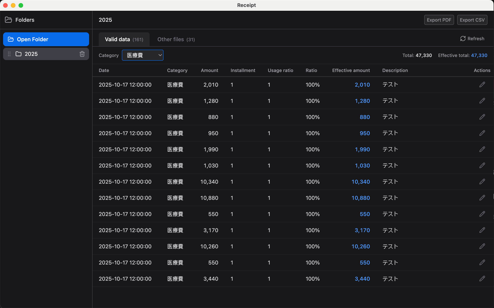

# Receipt

A desktop application built with Electron for managing invoices and receipts.

Scan a folder for receipt files, classify valid receipts by filename convention, preview files, and export expense data as CSV or PDF.




## Tech Stack

| Layer       | Technology |
|-------------|------------|
| Desktop     | Electron |
| Build       | Vite, TypeScript |
| Frontend    | React 19, TailwindCSS, Zustand |
| File Watch  | chokidar |

## Requirements

- **Node.js** >= 24.0.0
- **npm** 7+ (supports workspaces)

## Install and Run

```bash
# Clone the repository
git clone https://github.com/capricorncd/receipt.git
cd receipt

# Install dependencies (root installs all workspace packages)
npm install

# Run in development mode
npm run dev

# Build the desktop package
npm run package
```

## Project Structure

```
receipt/
├── package.json              # Root workspace and scripts
├── README.md
├── docs/
│   └── PROJECT_STRUCTURE.md  # Detailed structure and dependency guide
│
└── apps/
    └── desktop/              # Electron desktop app
        ├── package.json
        ├── vite.config.ts
        ├── electron/         # Main process
        │   ├── main.ts       # Window, protocol, and IPC registration
        │   ├── preload.ts    # Secure API exposure
        │   ├── ipc-handlers.ts
        │   ├── services/     # File scanning, metadata, and path validation
        │   └── types/
        └── src/              # Renderer process (React)
            ├── main.tsx
            ├── App.tsx
            ├── components/   # Layout, receipt panel, file preview
            ├── stores/       # Zustand state
            ├── types/
            └── lib/         # Receipt parsing and export helpers
```

## Usage

1. **Open a folder**: Click the “Open Folder” button and select a directory containing receipt files.
2. **Scan receipts**: The app parses filenames and lists valid receipts in the main tab. Other unmatched files appear under the “Other files” tab.
3. **Filter by category**: Use the category filter to view receipts by type.
4. **Preview and rename**: Open file previews, rename receipt files, and refresh the folder data.
5. **Export data**: Export filtered receipt data as CSV or PDF.

## Receipt filename format

Valid receipt file names follow:

```
yyyyMMdd-HHmmss-price-type-description.ext
```

Example:

```
20250118-120000-150-旅費交通費-JR乗車券_ocr.txt
```

## Security

- The main process uses `nodeIntegration: false` and `contextIsolation: true`, exposing only a limited API through preload.
- File access is restricted to opened directories, and paths are validated in the main process before read/write operations.

## Development Notes

- The desktop app is built by Vite and packaged with `electron-builder`.
- Receipt parsing is implemented in `apps/desktop/src/lib/receipt-parser.ts`.
- Export helpers are in `apps/desktop/src/lib/build-export-payload.ts`.

## License

MIT · Author: Capricorncd
